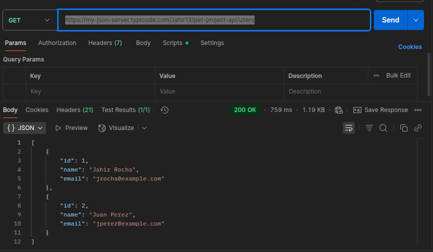

# Pet Project RESTful API

This project is a simple RESTful API for managing **users** using [my-json-server](https://my-json-server.typicode.com/).  
It supports basic CRUD operations: **Create, Read, Update, and Delete**.

---

## 1. Description

The API is built using a `db.json` file hosted in this GitHub repository.  
Once pushed to GitHub, the file is exposed as a RESTful API via **my-json-server**.

---

## 2. Base URL

```
https://my-json-server.typicode.com/Jahir13/pet-project-api
```

---

## 3. Endpoints

### **A) Get all users**
Retrieve the list of all users.

```
GET /users
https://my-json-server.typicode.com/Jahir13/pet-project-api/users
```

**Response:**



### **B) Get a user by ID**
Retrieve one user by ID.

```
https://my-json-server.typicode.com/Jahir13/pet-project-api/users/1
```

**Response:**


---

### **C) Create a user**
Add a new user.

```
POST /users
POST https://my-json-server.typicode.com/Jahir13/pet-project-api/users
```
**Response:**


---

### **D) Update a user**
Update user information (using PATCH or PUT).

```
PATCH /users/:id
PATCH https://my-json-server.typicode.com/Jahir13/pet-project-api/users/1
```

**Response:**  


---

### **E) Delete a user**
Delete an existing user.

```
DELETE /users/:id
DELETE https://my-json-server.typicode.com/Jahir13/pet-project-api/users/2
```
**Evidence screenshot:**  


The screenshots shown were made using Postman.

---

## 4. Testing

You can test this API using:
- [Postman](https://www.postman.com/)
- [Insomnia](https://insomnia.rest/)
- cURL or any HTTP client

---

## 5. Notes

- This API is **mocked**; changes (POST, PATCH, DELETE) are **not persistent**.
- It is based on the `db.json` file in this repository.

---

## 6. How to Run

1. Fork or clone this repository.
2. Edit `db.json` as needed.
3. Push to GitHub.
4. Access your API at:
   ```
   https://my-json-server.typicode.com/<your-username>/<your-repo-name>
   ```

---